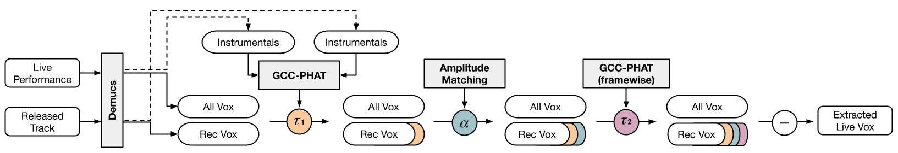

# Live Vocal Extraction
This repository accompanies **"Live Vocal Extraction for K-pop Performance"** by Yujin Kim, Richa Namballa, and Dr. Magdalena Fuentes (submitted to ISMIR 2025 as a Late Breaking Demo).

#### 🔗 Paper Link

[Link](https://arxiv.org/abs/2508.20273)

## Pipeline
<center></center>


## Getting Started

### Dependencies

* python 3.10

### Executing program

```
python --live path/to/live/audio.wav \
       --recorded path/to/recorded/audio.wav \
       --output_dir path/to/output/directory
```


## References
[1] S. Rouard, F. Massa, and A. Défossez, “Hybrid trans-
formers for music source separation,” in 2023 IEEE In-
ternational Conference on Acoustics, Speech and Sig-
nal Processing (ICASSP). IEEE, 2023, pp. 1–5.


